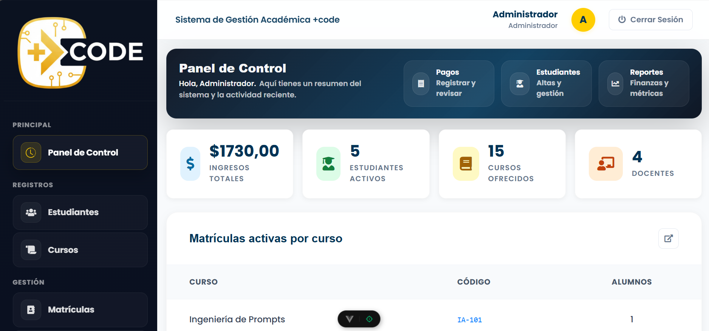

# +Code Academy

Vue 3 + Vite project.

## Requirements

- **Node.js**: `^20.19.0` or `>=22.12.0` (see `package.json` -> `engines`)
- **npm**: comes with Node.js

## Project structure

Root folders and what they are for:

- **`.vscode/`**
  - Editor settings for VS Code.
- **`assets/`**
  - Vendor/static assets used by the UI (DataTables, Font Awesome, vendor bundles, etc.).
- **`dist/`**
  - Production build output (generated by `npm run build`).
- **`documentation/`**
  - Internal project documentation and summaries.
- **`public/`**
  - Public static files served as-is by Vite.
  - Includes `public/assets/` and `favicon.ico`.
- **`requests/`**
  - Request specs / task descriptions.
- **`src/`**
  - Application source code.
  - **`src/components/`**: Vue components.
  - **`src/views/`**: View/page components.
  - **`src/css/`**: App styles.
  - **`src/js/`**: App JS helpers/modules.
  - **`src/main.js`**: App entry.
  - **`src/App.vue`**: Root component.

Key files at the root:

- **`index.html`**: Vite HTML entry.
- **`vite.config.ts`**: Vite configuration.
- **`package.json`**: scripts and dependencies.
- **`install-deps.bat` / `install-deps.sh`**: helpers to install dependencies.
- **`start-dev.bat` / `start-dev.sh`**: helpers to start the dev server.

## Recommended IDE Setup

[VS Code](https://code.visualstudio.com/) + [Vue (Official)](https://marketplace.visualstudio.com/items?itemName=Vue.volar) (disable Vetur).

## Recommended Browser Setup

- **Chromium-based browsers (Chrome, Edge, Brave, etc.)**
  - [Vue.js devtools](https://chromewebstore.google.com/detail/vuejs-devtools/nhdogjmejiglipccpnnnanhbledajbpd)
  - [Turn on Custom Object Formatter in Chrome DevTools](http://bit.ly/object-formatters)
- **Firefox**
  - [Vue.js devtools](https://addons.mozilla.org/en-US/firefox/addon/vue-js-devtools/)
  - [Turn on Custom Object Formatter in Firefox DevTools](https://fxdx.dev/firefox-devtools-custom-object-formatters/)

## Customize configuration

See [Vite Configuration Reference](https://vite.dev/config/).

## Install dependencies

You can use either the helper scripts or run npm directly.

### Option A: Helper scripts

- **Windows**
  - Run: `install-deps.bat`
- **Linux/macOS**
  - First time only:
    - `chmod +x ./install-deps.sh`
  - Run:
    - `./install-deps.sh`

### Option B: npm

- Run: `npm install`

## Start the development server

### Option A: Helper scripts

- **Windows**
  - Run: `start-dev.bat`
- **Linux/macOS**
  - First time only:
    - `chmod +x ./start-dev.sh`
  - Run:
    - `./start-dev.sh`

### Option B: npm

- Run: `npm run dev`
- Then open the URL printed in the terminal (usually `http://localhost:5173`).

## Production build

- Build: `npm run build`
- Preview the build locally: `npm run preview`

## Troubleshooting

- **Wrong Node.js version**
  - Make sure your Node.js version matches `package.json` -> `engines`.
- **Linux/macOS: “Permission denied” when running `.sh` files**
  - Run: `chmod +x ./*.sh`
- **Clean install**
  - Delete `node_modules/` and re-run `npm install`.
